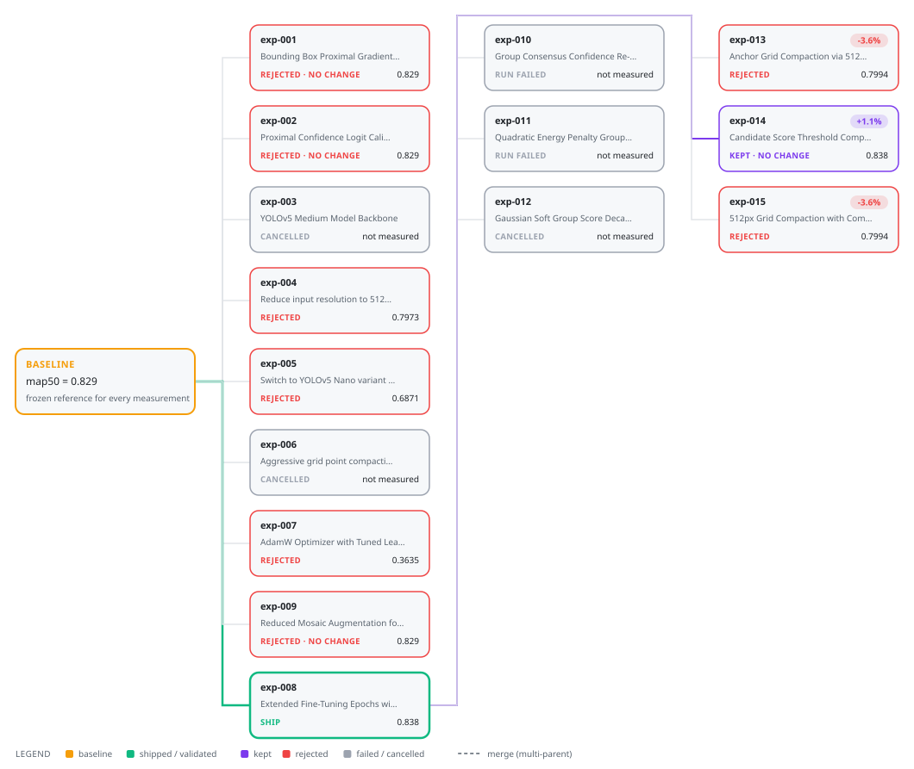

<div align="center">


  <h1>ResearchForge</h1>
  <p><strong>Your AI generates ideas. ResearchForge tests which ones actually hold up.</strong></p>
  <p><em>Claude Code or Cursor is the researcher. ResearchForge is the lab protocol.</em></p>
  <br/>
  <p><em>From papers to proof.</em></p>
  <p>
    <a href="https://pypi.org/project/researchforge/"></a>
    <a href="https://pypi.org/project/researchforge/"></a>
    <a href="LICENSE"></a>
    <a href="https://github.com/forger-labs-hq/researchforge/actions"></a>
  </p>

  <br/>

  <video src="https://github.com/user-attachments/assets/c367afe9-9f95-42f6-b6db-97e8ab02321b" controls width="720">
    <a href="assets/ResearchForgeIntro.mp4">▶ Watch the intro</a>
  </video>

  <p><sub> Product introduction </sub></p>

</div>

<!-- CHANGE 1: "into reproducible, traceable evidence. The agent proposes..." -->
ResearchForge turns a research question — or an "improve my repository"
goal — into reproducible, traceable evidence. The agent proposes; ResearchForge
freezes, executes, measures, rejects, and validates. It finds relevant papers,
generates testable hypotheses, benchmarks competing implementations against a
frozen baseline in isolated local workspaces, and delivers the strongest
supported result as a clean branch, an engineering report, or a research package.

Works with **Claude Code** (slash-command skills), **Cursor** (MDC rules),
or **standalone** with any AI API key — install once for your whole machine.

Inspired by Andrej Karpathy's
[autoresearch](https://github.com/karpathy/autoresearch), where an agent
autonomously runs training experiments against a fixed benchmark overnight —
ResearchForge generalizes that loop to any repository with a measurable
benchmark, and grounds it in literature: papers → hypotheses → controlled
experiments → a validated, reproducible result.

## See it work in ten minutes → [docs/demo.md](docs/demo.md)

Two guided walkthroughs, step by step, with the expected output at every step.

- **[Demo 1 — YOLOv5su on COCO128](docs/demo.md#demo-1--a-real-model-yolov5-on-coco128).**
  A real detection model on real images. Baseline `mAP@0.5 = 0.7395` at
  ~165 ms/image; the loop finds `yolov5mu`, which is the most accurate variant
  anything reached — **0.7683, +3.9%** — and **rejects it** for costing 291 ms
  against a 200 ms budget. Accuracy cannot buy its way past a hard constraint,
  and that rejection is the entire point of the demo.
- **[Demo 2 — the mechanics, offline](docs/demo.md#demo-2--the-mechanics-offline-and-deterministic).**
  No API key, no network, numbers identical to the page: one variant genuinely
  improves F1 to 0.90, one is rejected at 312 ms against a 200 ms budget, one
  fails outright — and all three stay on the record.

Timings are hardware-specific, so both demos tell you to re-measure rather than
trust their milliseconds — that is what `baseline run --n-runs 3` is for.

## Architecture: Researcher and Lab Protocol

<!-- CHANGE 2: add framing sentence before the table -->
Claude/Cursor stays creative. ResearchForge keeps evaluation deterministic.
Three parties with strict roles:

| Who | Does what |
|---|---|
| **You** | set the objective; approve the benchmark contract, each experiment plan, and anything that ships |
| **Your AI** (Claude Code, Cursor, or a direct API key) | reads the papers, writes the research landscape, hypotheses, and experiment patches; explains results |
| **ResearchForge CLI** (the orchestrator) | everything that must be trustworthy and cannot be influenced by a prompt: arXiv search, schema validation, worktree isolation, ranking, shipping — no AI output is ever trusted without passing the engine's validation layers |

The AI proposes; ResearchForge freezes, executes, measures, rejects, and validates.

Every artifact the AI writes is schema-validated before it is stored,
every experiment runs in a detached git worktree (your checkout is never
touched), and "validated" is only ever earned by repeated benchmark runs.

**Three ways to drive the AI layer:**

| Mode | How |
|---|---|
| Claude Code | `/researchforge-start` in any session |
| Cursor | `@researchforge-start` in the AI panel |
| Standalone (no IDE) | `export ANTHROPIC_API_KEY=…` then `researchforge research synthesize` |

---

## The autoresearch loop

ResearchForge implements a fully autonomous research loop inspired by the design
philosophy of continuous overnight experimentation — but grounded in literature,
constrained by hard metrics, and reproducible via git.

```bash
researchforge autorun --target 0.80 --max-hours 8 --yes
```

**What happens while you sleep** — the *shape* of a loop, not a transcript. The
numbers below are illustrative; for figures actually measured on hardware, see
[examples/yolov5-detection](examples/yolov5-detection/README.md).

```
Round 1 — expand the baseline with the hypotheses research synthesize found
  hyp-001: CONF tuning   → mAP improves      ✓ winner
  hyp-002: bigger model  → REJECTED (inference over the contract's budget)
  hyp-003: NMS threshold → no improvement    ✗ recorded anyway

Round 2 — expand exp-001, the winner, with the ideas still open there
  hyp-004: image size    → ✓ winner (CONF and image size together)
  hyp-005: augmentation  → ✗

Round 3 — nothing open anywhere → re-synthesize FROM THE RESULTS
  hyp-006: "CONF and image size compound" → builds on exp-004 → ✓ winner

Round 4,5,6 — no improvement anywhere → global_stall = 3 → STOP

Best: exp-006. Validated by repeated runs, or it is not called validated.
→ researchforge ship branch
```

Rounds 2 and 3 are the part that matters. Round 2 is not a re-roll of round 1:
it carries the surviving ideas onto the node that won, which is where they have
a different result to give. Round 3 only asks for new ideas once the graph has
nothing open left, and asks for them *from what the benchmark measured*, so the
loop pursues what worked and drops what didn't. And hyp-002 is the other
part — the most accurate variant losing on a hard constraint happens at 3am
exactly as it would with you watching. In the measured example, that rejection
is `yolov5mu`: the best mAP of anything tried, thrown out for taking 291 ms
against a 200 ms budget.

**Key design properties:**
- **Literature-grounded**: hypotheses come from arXiv papers, not random exploration
- **Multi-metric constraints**: hard limits enforced even during autonomous runs
- **DAG structure**: experiments can build on any previous winner, not just the last one
- **Reproducible**: every experiment is an exact git commit with full lineage
- **Human gates preserved**: contract + first batch require your typed approval;
  `--yes` skips only that first-batch prompt, never the contract

Every flag is documented once, in
[Decide how experiments get run](#8-decide-how-experiments-get-run) — the loop is
one of three ways to run experiments, and that section is where you choose.

### What a real run looks like

Not the sketch above — this is the experiment graph from an actual `autorun`
against a clone of `ultralytics/yolov5`, read straight out of that project's
records:



**Fifteen experiments. One survived.** Eight were rejected for not improving the
metric, two failed to execute and are kept on the record as failures, three were
cancelled when their plan hit the stall rule, one was kept, and one — `exp-008` —
was validated over repeated runs and shipped as a branch.

The graph is the argument for searching instead of iterating. `exp-008` won from
the baseline, and every experiment after it carried the remaining ideas *onto it*
rather than starting over — `exp-010` through `exp-015` all branch from `exp-008`,
which is why `exp-014` reads +1.1%: it inherited that from its parent. The
`NO CHANGE` badge is the honest part. `exp-001`, `exp-002` and `exp-009` ran
cleanly and moved the metric by exactly nothing, and `exp-014` improved on the
baseline while adding nothing to the parent it was built on. A tool that only
compared against the baseline would show four successes there. This shows one.

<details>
<summary>What this run does and does not prove</summary>

The winner changed `EPOCHS: 10 → 15` with a lower warmup, moving `map50` from
0.8290 to 0.8380, and three validation repeats agreed to sixteen decimal places.

That agreement is **determinism, not robustness** — the pipeline is seeded, so
repeats confirm reproducibility and say nothing about variance. This project also
fine-tunes on COCO128 and validates on the same 128 images, so part of the gain
is the model fitting what it is scored on. The result is honest about its own
scope: *on this benchmark, on this machine, training longer scored higher.*

It is a different setup from [examples/yolov5-detection](examples/yolov5-detection/README.md),
which does no training at all and evaluates the pretrained checkpoint — hence the
different baseline there (0.7395) and its different lesson, the rejection of a
more accurate model on a latency budget.
</details>

---

## Install

```bash
pip install researchforge       # Python 3.12+ required
```

No other dependencies. The AI SDKs (Anthropic, Gemini, OpenAI) are bundled.

> **Recommended for complex or public repos:** [install Docker](https://docs.docker.com/get-docker/) before running experiments.  
> ResearchForge will use it automatically — true process isolation, no dependency conflicts.  
> Venv mode is available without Docker but works best only for your own clean Python projects.

---

## Two journeys

Everything below is one of these. Pick the one that matches what you have.

| | You have | You end up with | Read |
|---|---|---|---|
| **A** | A research question and no code to benchmark | A literature-grounded landscape, testable hypotheses, and a citation-backed report | [Journey A](#journey-a--explore-a-research-idea) |
| **B** | A repository with something measurable in it | The same, plus experiments benchmarked against a frozen baseline and a validated change you can ship | [Journey B](#journey-b--improve-a-repository) |

Journey B contains Journey A: the papers and hypotheses come first either way.
Both work from Claude Code, from Cursor, or from the CLI with an API key.

---

## Journey A — Explore a research idea

You have a question; ResearchForge grounds it in literature.

<video src="https://github.com/user-attachments/assets/428eedb6-83eb-432e-8353-d31efe04b02c" controls width="100%">
  <a href="assets/ResearchForgeDemoResearch.mp4">▶ Watch the research flow demo</a>
</video>

<sub>↑ arXiv search → landscape → hypotheses → report</sub>

**From Claude Code or Cursor:** `/researchforge-start` (or `@researchforge-start`)
→ describe your question. Done.

**From the CLI:**

```bash
researchforge init                   # in any folder, empty or not
researchforge project create --mode explore_research_idea --objective "..."
researchforge research search        # AI generates queries + fetches arXiv papers
researchforge research synthesize    # AI writes landscape + hypotheses (auto-imported)
researchforge report build           # citation-backed Markdown report
researchforge paper package          # optional: BibTeX, outline, evidence matrix
```

**You end up with:** a research landscape (directions plus graded evidence —
published claim vs interpretation vs speculation), testable hypotheses, and a
citation-backed report. Details: [docs/research-mode.md](docs/research-mode.md).

---

## Journey B — Improve a repository

Everything in Journey A, then benchmarked experiments on your code.
**Every consequential step is your typed approval — nothing runs without it.**

<video src="https://github.com/user-attachments/assets/a29ed8e1-7b73-4826-a07b-b90e1dd4316b" controls width="100%">
  <a href="assets/ResearchForgeRepoDemoRepo.mp4">▶ Watch the improve-repository demo</a>
</video>

<sub>↑ baseline → experiments → validation → ship branch + PR</sub>

There are two ways to drive it, and they share the same project state — you can
switch between them at any point, or use both on the same project.

### ── Path A: Claude Code or Cursor ──

**What you need:** [Claude Code](https://claude.ai/code) or [Cursor](https://cursor.sh) installed and running on your machine.

### 1. Register ResearchForge with your IDE (once, machine-wide)

```bash
researchforge all install --user
# Claude Code skills → ~/.claude/skills/
# Cursor MDC rules  → ~/.cursor/rules/
# Both IDEs share the same .researchforge/ project state
```

### 2. Open your target in the IDE

Point your IDE at the repo you want to improve — or an empty folder for a research question.

**Options:**
- **Your existing local repo** — open the folder in Claude Code / Cursor
- **A GitHub repo** — clone it first, then open the folder:
  ```bash
  git clone https://github.com/owner/repo
  # then open that folder in Claude Code / Cursor
  ```
- **A new research question** — open any empty folder

### 3. Type one command and approve the steps

**Claude Code:**
```
/researchforge-start
```
> *"Improve this classifier's F1 without hurting latency"*  
> *"Can attention mechanisms outperform LSTM on this task?"*  
> *"Improve YOLOv5 mAP@0.5 without pushing inference past my latency budget"*

**Cursor:**
```
@researchforge-start
```
Same — describe your objective when prompted.

### What the IDE does from here (you only approve)

| Step | What Claude / Cursor does | Your role |
|---|---|---|
| Repo scan | Detects languages, benchmarks, test files | — |
| Eval script | Writes `benchmarks/evaluate.py` if none exists | Review |
| Contract | Generates `researchforge.yaml` with metric, constraints, paths | **Type `approve`** |
| Baseline | Runs your benchmark once to freeze the reference metric | — |
| Papers | Searches arXiv, stores relevant papers | — |
| Landscape + hypotheses | Synthesizes research directions and testable ideas | Review |
| Experiment plan | Writes `plan.yaml` + one code patch per variant | **Type `approve`** |
| Run | Runs all experiments automatically until stall | — |
| Validate | Re-runs the winner N times to confirm stability | — |
| Ship | Creates a clean local branch + engineering report | **Type `ship`** |

**You type three things total: `approve` (contract), `approve` (plan), `ship`.  
Everything else is automatic.**

`researchforge status` shows the exact next step at any point.  
The hub at http://127.0.0.1:9000 shows every project and its live state.

---

### ── Path B: Standalone CLI ──

**What you need:** An AI API key. No IDE required.

```bash
export ANTHROPIC_API_KEY=sk-ant-...   # Anthropic Claude
# OR
export GEMINI_API_KEY=...             # Google Gemini
# OR
export OPENAI_API_KEY=sk-...          # OpenAI GPT
```

ResearchForge auto-detects which key is set. Override the model with:
```bash
export RESEARCHFORGE_LLM=claude-opus-4-5   # or gemini-2.0-flash, gpt-4o
```

### About repos and folders

ResearchForge is **directory-scoped** — everything lives inside the target repo's folder (like git). When you run `researchforge init` it creates a `.researchforge/` directory there and all state, worktrees, artifacts, and dashboards live under it.

**Your options:**

```bash
# Option 1 — improve your own existing repo
cd ~/projects/my-repo

# Option 2 — clone a GitHub repo and improve it
git clone https://github.com/owner/repo
cd repo

# Option 3 — pure research question (empty folder)
mkdir ~/my-research && cd ~/my-research
git init -b main && git commit --allow-empty -m "start"
```

Then run from inside that folder. All `researchforge` commands walk up to find the project root (like `git`) so you can run from any subfolder.

### Full command sequence

```bash
# ── 1. Initialize ────────────────────────────────────────────────────────────
researchforge init
researchforge project create \
  --mode improve_repository \
  --objective "Improve YOLOv5su mAP@0.5 on COCO128 while keeping inference under 200ms"
# For a pure research question: --mode explore_research_idea

# ── 2. Scan the repo ─────────────────────────────────────────────────────────
researchforge repo scan .
# Detects language, dependencies, existing benchmarks, suggested editable paths.
# If your repo already has a benchmark script it finds it here.

# ── 3. Search relevant literature ───────────────────────────────────────────
researchforge research search
# Your AI key generates domain-specific arXiv queries (not generic keyword search).
# Example output: "YOLOv5 model pruning COCO", "knowledge distillation YOLO real-time", ...

# ── 4. Generate hypotheses ───────────────────────────────────────────────────
researchforge research synthesize
# AI reads the papers and writes landscape.yaml + hypotheses.yaml.
# Validates against the schema — invalid output is rejected and reported.

# ── 5. Generate the eval script (if your repo has no benchmark yet) ──────────
researchforge generate eval-script
# AI reads the repo scan and writes:
#   benchmarks/evaluate.py   — runs your code, writes artifacts/results.json
#   src/config.py             — tunable constants experiments will patch
# Skip this if you already have a benchmark.

# ── 5b. Generate a Dockerfile (recommended for public/complex repos) ─────────
researchforge generate dockerfile
# Writes a working Dockerfile from the repo scan (no API key needed).
# Add --provider anthropic|google|openai for an AI-tailored version.
# RF uses it automatically when Docker is installed.

# ── 6. Generate + review the contract ────────────────────────────────────────
researchforge contract generate
# Auto-fills researchforge.yaml from the scan:
#   - full_command: python benchmarks/evaluate.py
#   - screening_command: python benchmarks/evaluate.py --quick
#   - primary metric, hard constraints, editable/protected paths
# Review and edit researchforge.yaml before approving.

researchforge contract approve
# You type "approve" — this freezes the contract. Nothing runs until you do.

# ── 7. Freeze the baseline ───────────────────────────────────────────────────
researchforge baseline run
# Runs your benchmark once at the current commit.
# Result is immutable — all experiments are measured against this.
```

### 8. Decide how experiments get run

**Read this before running step 9.** Everything up to here is shared setup.
From here there are three ways to turn hypotheses into measured experiments,
and they are not interchangeable — pick one now rather than discovering the
others afterwards.

| | You want | Command |
|---|---|---|
| **A** | The whole thing, unattended, until it stops improving | `researchforge autorun` |
| **B** | Every hypothesis planned now, run them yourself | `researchforge experiment plan --all --synthesize` |
| **C** | One hypothesis at a time, inspecting as you go | `researchforge experiment plan hyp-001 --synthesize` |

All three need an API key. All three keep the same gates: the contract was
already approved in step 6, and nothing runs against your repo without an
approval on record.

#### A — the autonomous loop (what most people mean by "run it")

```bash
researchforge serve --background     # LIVE monitor — start it BEFORE autorun
researchforge autorun --target 0.85 --max-hours 8 --yes
```

Each round picks a node of the experiment graph to expand — the current best,
by default — and tries the highest-ranked hypotheses that are still open there.
A hypothesis is open at a node when it has not already been tried at that node
and does not already appear in that node's lineage, so the same idea can be
tested again further up the graph without ever being applied on top of itself.
Ranking favours what has already improved the metric somewhere, then what has
never been tried at all. With `--max-hours` set, a round takes as many
hypotheses as the remaining time can pay for; without one it takes a single
move, measures, and re-selects.

When nothing anywhere in the graph is left to try, it **re-synthesizes new
hypotheses from what was actually measured** and goes again — until it stalls,
reaches `--target`, or runs out of `--max-hours`.
`--yes` skips the first-batch approval prompt for an overnight run; Ctrl-C is
expected, and `researchforge autorun --resume` continues with the same stall
counter and time budget. This is the only option that generates *new* ideas
from results; A and B test the hypotheses you already have and stop.

**When to stop, and what to spend:**

| Flag | Default | What it does |
|---|---|---|
| `--stall INTEGER` | `2` | Give up on one plan after N consecutive non-improving experiments |
| `--global-stall INTEGER` | `3` | Stop the whole loop after N rounds with no improvement anywhere |
| `--max-rounds INTEGER` | none | Hard cap on synthesis rounds |
| `--max-hours FLOAT` | none | Wall-clock limit — the overnight safety cap |
| `--target FLOAT` | contract's `target_value` | Stop as soon as the primary metric reaches this |

**How it explores:**

| Flag | Default | What it does |
|---|---|---|
| `--compound` / `--no-compound` | on | Build each round on a node of the experiment graph instead of on the baseline |
| `--explore FLOAT` | `0.0` | UCB1 exploration constant. `0` always expands the current best; higher values revisit under-explored branches instead of following the leader |
| `--merge` / `--no-merge` | off | Each round, try combining two independent winners into one multi-parent experiment. When their diffs overlap, the AI is asked to author the combination as a single patch |
| `--resynthesize` / `--no-resynthesize` | on | Generate new hypotheses from the measured results each round. Turn it off to only test the hypotheses you already have |

**Everything else:**

| Flag | Default | What it does |
|---|---|---|
| `--observe` / `--no-observe` | off | After each experiment, have the AI read its benchmark output and record a paragraph on what the run showed. Costs one AI call per experiment |
| `-p/--provider TEXT` | auto-detected | `anthropic` \| `google` \| `openai` |
| `-m/--model TEXT` | provider default | Override the model name |
| `--resume` | — | Continue the interrupted loop recorded in `.researchforge/autorun.json` |
| `-y/--yes` | off | Unattended — skip the first-batch approval prompt |
| `--json` | off | Machine-readable output |

##### Watching a loop while it runs

`autorun` narrates each round in your terminal — which node it is expanding and
why, a clock on every AI call, and a one-line verdict per finished experiment —
but it does **not** open a dashboard on its own. Start the live monitor first if
you want one:

```bash
researchforge serve --background   # LIVE monitor — start it BEFORE autorun
researchforge dashboard --open     # STATIC snapshot — build it whenever you like
```

Both are described in
[Experiment tracking dashboard & live monitor](#experiment-tracking-dashboard--live-monitor).

##### Trying a short loop before committing to an overnight one

`--target 0.85 --max-hours 8 --yes` is the overnight shape: it may run for
hours without asking you anything. That is a lot to hand over before you have
seen the loop behave. This is the same loop, scaled down to something you can
watch end to end in one sitting:

```bash
researchforge serve --background            # 1. live monitor, URL is printed
researchforge autorun --max-rounds 2 --observe   # 2. two rounds, then stop
```

- `--max-rounds 2` stops after two rounds of *plan → run → re-synthesize*,
  so it finishes on its own instead of running until it stalls.
- `--observe` has the AI read each experiment's benchmark output and write a
  paragraph on what it showed. Those paragraphs land in
  `.researchforge/research-log.md` and in `researchforge experiment show`, and
  they are the fastest way to tell whether the loop is reasoning about your
  benchmark or flailing at it.
- No `--yes`, so it still stops for your typed approval before the first batch
  — you see the planned experiments before anything executes.

Then read the results (`researchforge results show <run-id>`, or the dashboard),
and if the loop is doing sensible work, start the real one with `--yes`,
a `--target`, and a `--max-hours` budget.

Skip to step 10 when it finishes — it has done steps 8 and 9 for you.

#### B — plan every hypothesis, then run each plan

```bash
researchforge experiment plan --all --synthesize
#   Found 5 pending hypothesis(es): hyp-001, hyp-002, hyp-003, hyp-004, hyp-005
# ✓ Planned 5 hypothesis(es): plan-001, plan-002, plan-003, plan-004, plan-005
```

`--all` requires `--synthesize` and an API key: without AI there is nothing to
plan with, only a context file for an IDE to fill in one hypothesis at a time.
A hypothesis whose planning fails is skipped and the rest continue.

It produces **one plan per hypothesis**, so you approve and run each by its id
rather than passing a `plan.yaml` file:

```bash
researchforge experiment list                # every plan and its experiments
researchforge experiment approve plan-001    # your typed approval, per plan
researchforge experiment run plan-001
```

`plan.yaml` on disk is a scratch file, rewritten and re-imported for each
hypothesis in turn; once imported, the plan lives in the project database.

#### C — one hypothesis at a time

This is the path the numbered steps below continue with. It is the slowest and
the easiest to follow, because you see one plan's patches before anything runs.

```bash
# ── 8c. Plan one hypothesis ──────────────────────────────────────────────────
researchforge experiment plan hyp-001 --synthesize
# AI reads the hypothesis, contract, and baseline result, then writes:
#   .researchforge/experiments/plan.yaml   — experiment variants
#   patches/ or env_overrides              — the actual changes per variant
# Imported and validated automatically.

# ── 9. Approve and run that plan's experiments ──────────────────────────────
researchforge run .researchforge/experiments/plan.yaml
# Shows: experiment list, worst-case time estimate
# You type "approve" — then it's fully automatic:
#   exp-001: screening → full benchmark → decision (pass/reject)
#   exp-002: screening → full benchmark → decision
#   ... continues until stall (N consecutive non-improvements) or all done
# Set stall in researchforge.yaml: execution.stall: 3
```

### The rest is the same whichever you picked

```bash
# ── 10. Review results ───────────────────────────────────────────────────────
researchforge results show run-001
# Shows: ranked experiments, constraint violations, failures
# Open the dashboard: researchforge dashboard --open

# ── 11. Validate the winner ──────────────────────────────────────────────────
researchforge validate run-001
# Re-runs the best experiment N times (from contract: validation.repeat_finalists)
# "Validated" is only earned here — one run is never enough.

# ── 12. Ship ─────────────────────────────────────────────────────────────────
researchforge ship branch             # clean LOCAL branch + engineering report —
                                      # validated winner, traceable lineage, rejection history
researchforge report build
# Writes .researchforge/reports/engineering-report.md — full evidence chain.

researchforge ship pr   # optional: push + open a DRAFT PR (requires gh CLI)
```

### Managing runs, whichever path you took

| I want to… | Command |
|---|---|
| start a batch (one command) | `researchforge run plan.yaml` |
| watch it live | `researchforge serve --background` (URL is printed) |
| see ALL projects + their folders | `researchforge hub --background` → http://127.0.0.1:9000 |
| stop a running batch | **Ctrl-C** — always safe (isolated worktrees) |
| continue an interrupted run | `researchforge experiment resume run-001` |
| discard an interrupted run | `researchforge experiment abandon run-001` |
| run another batch | `researchforge experiment plan hyp-002` → start again |
| build on a previous experiment | `parent: exp-001` in the next plan entry |
| see what's next, always | `researchforge status` |
| see where everything lives | `researchforge paths` |
| reset the whole project | `rm -rf .researchforge researchforge.yaml` |

Everything is local; nothing outside your repository is ever created. To
redefine just the objective on existing data:
`researchforge project create --force-update`.
[docs/claude-mode.md](docs/claude-mode.md) explains exactly what the Claude
skills do and cannot do.

---

## Complete command reference

Every command and flag below is the real CLI surface. `--help` on any command
is authoritative, and **every command accepts `--json`** for scripting unless
noted. The global `-C/--dir DIRECTORY` runs as if started elsewhere:

```bash
researchforge -C ~/projects/my-repo status
```

Commands are grouped in `researchforge --help` by the same panels used here.

### Setup

| Command | What it does |
|---|---|
| `researchforge doctor` | Check git / Python / Docker are usable. **Run this first if anything fails.** |
| `researchforge init` | Create `.researchforge/` in the current directory |
| `researchforge init --claude` | …and install the Claude Code skills |
| `researchforge init --cursor` | …and install the Cursor rules |
| `researchforge status` | Where the project stands, and the exact next command |
| `researchforge paths` | Every location this project uses on disk |
| `researchforge project create --mode improve_repository --objective "…"` | Create/resume the project. Modes: `improve_repository`, `explore_research_idea` |
| `researchforge project show` | The stored project definition |
| `researchforge repo scan .` | Detect language, deps, benchmarks, suggested editable/protected paths |

### Research

| Command | What it does |
|---|---|
| `researchforge research search` | arXiv fetch → dedup → rank → store. Queries are AI-generated from the objective when a key is set |
| `  -q/--query TEXT` | Your own query; repeatable. Omit to auto-generate |
| `  -n/--select INT` | How many papers to keep |
| `  --min-score FLOAT` | Minimum relevance (0–1) |
| `  -c/--categories TEXT` | arXiv category filter; repeatable, e.g. `-c cs.CV -c cs.LG` |
| `  --since YYYY-MM-DD` | Only papers submitted on/after this date (applied inside the arXiv query) |
| `  --max-candidates INT` | Retrieval cap before ranking |
| `  --force` | Replace papers already cited by hypotheses |
| `  -p/--provider TEXT` | `anthropic` \| `google` \| `openai` |
| `researchforge papers list` / `show <paper-id>` | Stored papers, ranked by relevance |
| `researchforge papers export <file>` | Write every stored paper to JSON |
| `researchforge papers import <file>` | Import an exported set (validated; matched by id) |
| `researchforge research synthesize` | **Standalone AI**: landscape + hypotheses, written and imported |
| `  --from-results` | Ground it in what this project already measured; new hypotheses are *added*, restatements skipped |
| `  --run TEXT` | With `--from-results`, use one run's outcomes instead of all |
| `  --no-import` | Write the YAML but don't import |
| `  -p/--provider`, `-m/--model` | Pick provider / override model |
| `researchforge hypotheses generate` | Alias for `research synthesize` |
| `researchforge research context` | Export `context.json` for an IDE to synthesize from |
| `researchforge research landscape --import <file>` | Import a landscape artifact (omit `--import` to show the stored one) |
| `researchforge hypotheses import <file>` | Import a hypotheses artifact |
| `researchforge hypotheses list` / `show <hyp-id>` | Stored hypotheses and their review state |
| `researchforge hypotheses review` | Walk unreviewed hypotheses one at a time |
| `researchforge hypotheses approve hyp-001 hyp-003 [--reason TEXT]` | Approve without the interactive walk |
| `researchforge hypotheses reject hyp-005 --reason TEXT` | **Rejection is the part with teeth** — planning, import, and autorun all skip it |
| `researchforge generate eval-script` | AI writes `benchmarks/evaluate.py` + `src/config.py` |
| `  --existing PATH` | Adopt an eval script you already have instead of generating one |
| `  --force`, `--output-dir PATH` | Overwrite / write elsewhere |
| `researchforge generate dockerfile [--cuda] [--force]` | Write a Dockerfile (AI-tailored with a key, heuristic without) |
| `researchforge report build [--output PATH]` | Research report now; engineering report once experiments exist |

### Experiments

| Command | What it does |
|---|---|
| `researchforge contract generate` | Draft `researchforge.yaml` from the project + scan |
| `researchforge contract validate` | Schema + semantic rules. Safe to repeat, no side effects |
| `researchforge contract approve [--yes]` | **Typed approval** → immutable contract version |
| `researchforge contract show` | The active approved contract |
| `researchforge baseline run` | Freeze the reference measurement in an isolated worktree |
| `  --n-runs INT` | Measure N times and freeze the **mean**, recording each value and the spread |
| `  --check` | Resolve the environment and stop — no execution |
| `  --no-auto-recover` | Don't attempt setup-failure fixes (auto-recovery is on by default) |
| `researchforge baseline show` / `status` | The frozen baseline |
| `researchforge baseline reset --confirm [--force]` | Drop it. Refuses without `--force` when experiments were measured against it |
| `researchforge experiment plan <hyp-id>` | Export planning context for one hypothesis |
| `  --all` | Plan every pending hypothesis |
| `  --synthesize` | Have the AI write `plan.yaml` + patches directly |
| `researchforge experiment import <plan.yaml>` | 6-layer validation; protected-path patches are recorded as rejected, never run |
| `researchforge experiment approve <plan-id> [--yes]` | **Typed approval**, worst-case wall time shown |
| `researchforge experiment run <plan-id>` | Screening → full, one experiment at a time |
| `  --stall INT` | Stop after N consecutive non-improvements (overrides the contract) |
| `  --no-monitor` | Don't auto-start the live monitor |
| `researchforge experiment start <plan.yaml>` | Import + approve + run, with **one** typed approval |
| `researchforge run <plan.yaml>` | Alias for `experiment start` |
| `researchforge experiment resume <run-id>` | Continue an interrupted run |
| `researchforge experiment abandon <run-id>` | Discard an interrupted run (finished results are kept) |
| `researchforge experiment cancel <plan-id>` | Cancel a not-yet-run plan |
| `researchforge experiment list` / `show <exp-id>` | Plans, experiments, and full detail |
| `researchforge validate <run-id>` | Repeated finalist runs — the only way to earn "validated" |
| `  -e/--experiment TEXT` | Validate only these experiment ids |
| `  --n INT` | Repeats for this validation, overriding the contract |
| `  --stdev-max FLOAT` | Refuse a finalist whose repeats spread wider than this, however good the average |

### The autonomous loop

```bash
researchforge autorun --target 0.85 --max-hours 8 --yes
researchforge autorun --resume     # continue an interrupted loop
```

Every flag, grouped by what it controls, is in
[A — the autonomous loop](#a--the-autonomous-loop-what-most-people-mean-by-run-it)
above, so there is one table to keep correct rather than two.

The contract approval and the first batch's approval are still typed by you.
There is exactly one prompt in a loop — before round 1 — and `--yes` is what
skips it. Every later round runs unattended either way.

### Results, shipping, and audit

| Command | What it does |
|---|---|
| `researchforge results show <run-id>` | Ranking, Pareto trade-offs, constraint violations, rejected + failed experiments |
| `researchforge dashboard [--open]` | Self-contained static HTML: progress chart, per-experiment bars, trade-off scatter, funnel, validation spread, experiment graph |
| `  --run TEXT`, `--output PATH` | Pick the run / write elsewhere |
| `researchforge ship branch [exp-id]` | Clean local branch on the frozen baseline, after a pre-ship re-run. **Never pushed** |
| `  --branch TEXT`, `--yes` | Override the derived name / skip the prompt |
| `researchforge ship pr [exp-id]` | Opt-in twice: contract flag **and** a typed `push`. Always a **draft** PR |
| `researchforge report build` | Engineering report with the full evidence chain |
| `researchforge paper package` | Research bundle: BibTeX, related work, evidence matrix, outline, data |
| `researchforge audit log` | Everything this project did, oldest first — derived from its own records |
| `  --last INT` | Only the most recent N entries |
| `  --kind KIND` | One kind, e.g. `contract_approved`, `plan_approved`, `experiment_decided` |
| `researchforge audit export <file>` | The full trail as JSON, including gate findings |

### Live monitoring (needs `pip install "researchforge[serve]"`)

| Command | What it does |
|---|---|
| `researchforge serve --background` | Read-only live monitor for this project; URL is printed |
| `  --status` / `--stop` / `--open` | Manage it |
| `  --host TEXT` / `--port INT` | Bind address (loopback by default) / preferred port |
| `researchforge hub --background` | Every project on this machine in one read-only dashboard |
| `  --prune` | Drop projects that no longer exist on disk |

### Editor integrations

| Command | What it does |
|---|---|
| `researchforge claude install [--user] [--force]` | Claude Code skills → `.claude/skills/` (or `~/.claude/`) |
| `researchforge cursor install [--user] [--force]` | Cursor rules → `.cursor/rules/` (or `~/.cursor/`) |
| `researchforge all install --user` | Both at once |
| `researchforge all status` | Installed / modified / missing, per file |
| `researchforge {claude,cursor,all} uninstall` | Remove them (user-modified files are kept) |
| `researchforge analytics {enable,disable,status,show}` | Opt-in, local-only. Nothing leaves your machine |

---

## Docker vs Venv — which mode to use

ResearchForge runs experiments in **isolated worktrees**. Each experiment gets its own copy of the repo at the baseline commit. The execution environment inside that worktree is either a **Docker container** or a **Python venv clone** depending on what's available.

| | Docker | Venv |
|---|---|---|
| **Isolation** | Full process + filesystem isolation | Python packages only |
| **Best for** | Any public repo you cloned (YOLOv5, HuggingFace, etc.) | Your own clean Python project |
| **Requirement** | Docker installed | Python 3.12+ (already required) |
| **First run** | ~2 min to build image (cached after) | Seconds |
| **Dependency conflicts** | Never — each container is fresh | Possible for complex repos |
| **Setup failures** | Extremely rare | Possible (complex `pyproject.toml`, native extensions) |

### Getting Docker

```bash
# macOS
brew install --cask docker
# Then open Docker Desktop to start the daemon

# Linux
curl -fsSL https://get.docker.com | sh
```

Verify: `docker info` — if it prints engine details, you're ready.

### Generating a Dockerfile (if your repo doesn't have one)

```bash
# No API key needed — RF builds a minimal Dockerfile from the repo scan:
researchforge generate dockerfile

# With an API key — AI writes a fully tailored Dockerfile:
researchforge generate dockerfile --provider anthropic
```

The generated Dockerfile is written to the project root. RF uses it automatically when `execution.mode: auto` (the default) and Docker is available.

### Setting the mode explicitly

In `researchforge.yaml`:
```yaml
execution:
  mode: docker   # force Docker even when venv would work
  # mode: venv   # force venv (only for trusted repos you wrote)
  # mode: auto   # Docker if available, else venv (default)
```

---

## Auto-Recovery — what happens when something goes wrong

ResearchForge recovers from common failures automatically. You do not need to edit config files or re-approve manually in most cases.

### Setup failures (`baseline run` and experiment worktrees)

When the setup command fails (wrong install command, pip version, missing system deps, C extension build errors), ResearchForge:

1. Reads the error log
2. Matches against a rule set of known error patterns
3. Tries progressively smarter fix commands (below)
4. If a fix works: updates the contract's `setup_command` and continues — **no manual intervention needed**
5. If all fixes fail: **automatically escalates to Docker mode** — generates a Dockerfile, switches the contract, re-approves, and retries

Auto-recovery is **on by default**. Disable it with:
```bash
researchforge baseline run --no-auto-recover
```

| Error pattern | Fixes attempted (in order) |
|---|---|
| `pyproject.toml` has no build backend ("flat-layout") | 1) Switch to `pip install -r requirements.txt` · 2) `--no-build-isolation` to skip local-package build · 3) Run pip from `/tmp` so setuptools can't see the local `pyproject.toml` · 4) Pin `setuptools<70` to bypass strict flat-layout detection |
| pip/setuptools too old | Upgrade pip + setuptools + wheel first, retry |
| pip not found in venv | Bootstrap with `python -m ensurepip`, retry |
| Network timeout / connection refused | Retry with `--no-deps` to skip transitive fetches |
| C extension compile failure | Retry with `--only-binary :all:` |
| CUDA/GPU driver mismatch | Retry with CPU-only PyTorch wheel |
| Permission denied | Retry with `--user` flag |
| Disk full | Clear pip cache (`pip cache purge`), retry |
| Version conflict | Retry with `--no-deps` then `--upgrade-strategy eager` |
| Python version mismatch | Escalate to Docker immediately |
| Generic / unknown failure | Switch from `pip install -e .` to `pip install -r requirements.txt` |

### Automatic Docker escalation (last resort)

When every fix strategy fails, ResearchForge automatically:

```
1. Checks Docker is installed and the daemon is running
2. Generates a Dockerfile  (researchforge generate dockerfile)
3. Switches researchforge.yaml → execution.mode: docker
4. Re-approves the contract
5. Retries the baseline in a Docker container
```

**You don't type anything** — it all happens automatically. If Docker isn't installed you get a one-line install instruction and the process stops cleanly.

Repeated recovery failures mean the project has system-level dependencies (CUDA
drivers, OpenCV native libs, custom build tools) that a venv cannot handle —
the normal case for ML repos cloned from GitHub. That is what
[Docker mode](#docker-vs-venv--which-mode-to-use) is for, and the escalation
above does it for you.

### Other recoverable situations

| Situation | What RF does |
|---|---|
| Interrupted run (Ctrl-C) | `researchforge experiment resume run-001` picks up where it stopped |
| Stale worktrees | Automatically cleaned up before next run |
| Contract changed after approval | Detected immediately — `researchforge contract approve` to re-freeze |
| Baseline drifted (you changed code) | `researchforge baseline run` freezes a new reference |
| Experiment patch doesn't apply | Recorded as `failed_setup` — others continue running |
| Protected path touched by patch | Recorded as `rejected` immediately — experiment never runs |

---

## Security & Isolation — What Runs Where

ResearchForge is a **local-only CLI** — no data leaves your machine.

- **Experiments** run in detached git worktrees: your working checkout is never touched, modified, or read during a run
- **No network calls** during execution — the contract's `network.mode: none` disables outbound connections inside experiment processes
- **No credentials forwarded** unless you explicitly list them in `secrets.forward_environment_variables`
- **AI writes patches; the Python engine enforces** — every proposed change is validated against the approved contract before it executes; the AI cannot bypass protected paths, resource limits, or approval gates
- **All state is in `.researchforge/`** — fully inspectable, deletable with `rm -rf .researchforge researchforge.yaml`

Isolation is **local, not a hostile-code sandbox**: it protects your checkout
from a bad patch, not your machine from code you chose to run. Use Docker mode
for anything you did not write yourself.

## The examples

| Example | What it shows | Needs |
|---|---|---|
| [examples/yolov5-detection](examples/yolov5-detection/README.md) | A real model: the accurate variant rejected on a latency budget, and how noisy timings force `--n-runs` | torch, network, a key for the AI steps |
| [examples/simple-python](examples/simple-python/README.md) | Every mechanic in ten minutes, deterministic to the decimal | nothing |
| [examples/docker-python](examples/docker-python/README.md) | The same mechanics under Docker isolation | Docker |

Each example README is a runnable step sequence; [docs/demo.md](docs/demo.md)
walks the first two with the expected output at every step.

## Experiment Tracking Dashboard & Live Monitor

Two ways to *see* how experiments perform against the baseline:

```bash
researchforge dashboard --open       # one self-contained HTML snapshot
```

A single static file with an autoresearch-style **progress chart** — every
experiment as a chronological dot, kept improvements annotated, a running-best
step line — plus per-experiment bars vs the baseline, the trade-off scatter with
the hard-constraint line, the funnel with drop-offs, and validation spread.

The dashboard also includes the **experiment graph** — a DAG from the baseline
through every branch of experiments. Winning paths are highlighted; rejected
variants are shown in context. Nodes link to full experiment details. As the
autorun loop matures, the graph shows multi-round structures with backtracking
and compound experiments.

```bash
pip install "researchforge[serve]"   # adds the live web monitor
researchforge serve --background     # live monitor for THIS project (URL printed)
```

A local web monitor that follows runs **as they happen**: overview with the
next action, collapsible research sessions with the full recorded detail
(directions, evidence, limitations, underexplored aspects), per-run
execution timelines with work locations on disk, the experiment graph with
**click-through drill-down pages** for every experiment (lineage, decision,
executions, artifacts on disk), the live chart dashboard, and a JSON API
(`/api/state`). Once the extra is installed, `experiment run`/`start`
auto-start it and print the URL. Manage it with `researchforge serve
--status` / `--stop`. The server opens the database **read-only** and binds
127.0.0.1 only by default — watching can never interfere with a run.

### The hub — every project, one dashboard

```bash
researchforge hub --background       # http://127.0.0.1:9000 — all projects
```

Projects live in whatever folders you initialize them in, and it is easy to
forget which. The **hub** is one machine-wide page listing every project
with its **folder location**, status, and live activity; click through to
any project's full monitor (sessions, runs, experiment graph, drill-downs).
Every `researchforge init` registers the project, so new projects appear
automatically — and once the `serve` extra is installed, **any researchforge
command quietly ensures the hub is running**, so `http://127.0.0.1:9000`
is simply always there (set `RESEARCHFORGE_NO_HUB=1` to opt out). Commands
run in a subfolder of a project also walk up to find it (like `git`) and
print `Using project at <root>` so you always know which project you're in.

## Supported repositories (beta)

The improve-repository journey currently expects:

- a **git** repository with **user-owned or trusted code** (isolation is
  local, not a hostile-code sandbox — see [Security & Isolation](#security--isolation--what-runs-where));
- a **Python 3.12+** single project or single target service;
- an existing **Dockerfile** or simple Python dependency metadata
  (`requirements.txt` / `pyproject.toml`);
- a **machine-readable benchmark** (a command that writes JSON metrics)
  with **bounded runtime**;
- no production infrastructure required.

The explore-research-idea journey works anywhere. Repositories outside this
matrix are reported honestly by `researchforge repo scan` rather than
half-supported.

## Beta feedback

This is a narrow-but-complete beta — reports shape what gets built next.
Use the issue templates ([bug](.github/ISSUE_TEMPLATE/bug_report.yml),
[setup failure](.github/ISSUE_TEMPLATE/setup_failure.yml),
[beta feedback](.github/ISSUE_TEMPLATE/beta_feedback.yml)). Optionally,
`researchforge analytics enable` records **local-only** coarse events —
nothing is transmitted — and `researchforge analytics show` computes the
beta metrics you can choose to include in a report.

## Working on ResearchForge itself

```bash
git clone https://github.com/forger-labs-hq/researchforge
cd researchforge
python -m venv .venv && source .venv/bin/activate
pip install -e ".[serve,dev]"
```

Switch between projects anytime with `researchforge -C /path/to/other-project <command>`.
Print all file locations with `researchforge paths`.

## More documentation

- [docs/demo.md](docs/demo.md) — the launch demo, step by step
- [docs/claude-mode.md](docs/claude-mode.md) — working from Claude Code (skills)
- [docs/research-mode.md](docs/research-mode.md) — the research journey (CLI)
- [docs/experiment-mode.md](docs/experiment-mode.md) — contract, funnel, shipping (CLI)
- [docs/architecture.md](docs/architecture.md) — code layout

Installing the IDE integrations is in
[Editor integrations](#editor-integrations) in the command reference.

## License

Apache-2.0 — see [LICENSE](LICENSE).
